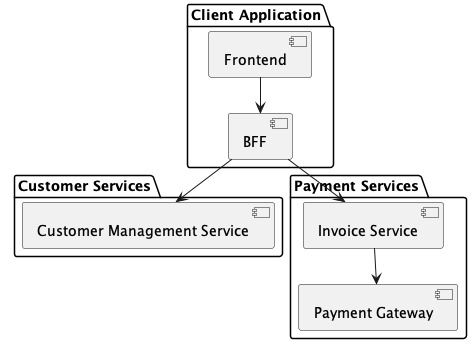
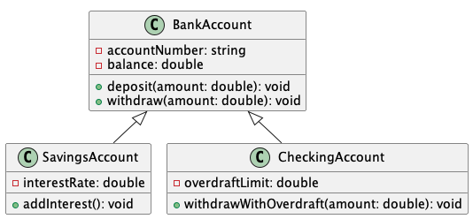

== Architecture Overview

***

This section is usually used to provide the context of your project. It is helpful to give a contextual diagram to illustrate how the system you are building fits in with the existing applications at a high level.
You can provide:

* high level overview of the requirements,
* list of stakeholders,
* ..etc.

=== Detailed Architecture

***

In this section, you provide all the details of your architecture using different diagrams. Use various diagrams to represent different views of your solution, such as:

* Deployment Diagrams
* Runtime Diagrams
* Collaboration and sequence diagrams
* Class Diagrams

